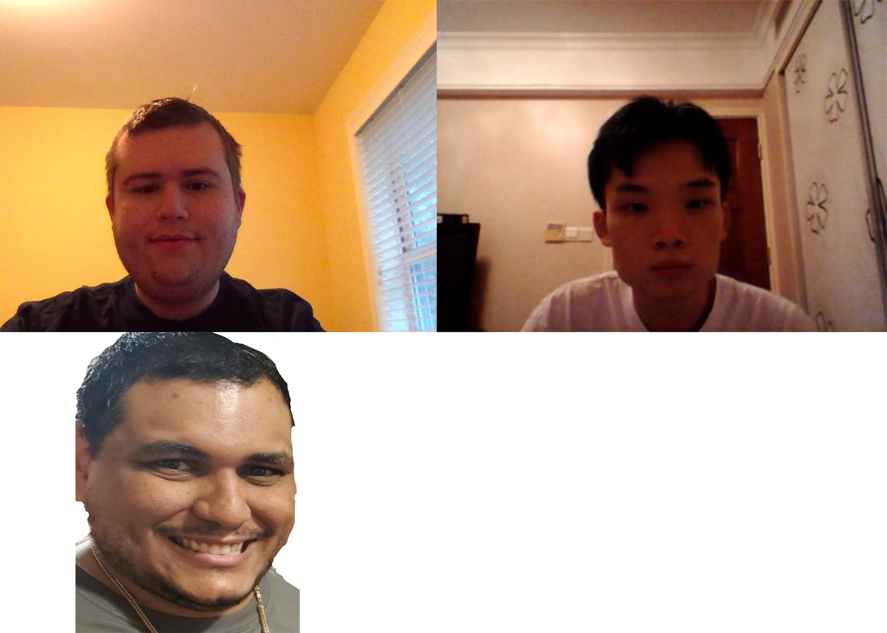

# Fall 2021 CS 389 Team 8 Project

**My Teacher**

**Team** 
[Benjamin Fein](https://github.com/benfein), [Jonathan Sánchez](https://github.com/Aviel32), [Yi Liu](https://github.com/yl58558p)

**App description**

[Idea Proposal](https://docs.google.com/document/d/1I-gjR3WV-8_1gmvqBqId-87ea66XdRQC2WG-SMUJ6ZA/edit?usp=sharing)

[Calendar](https://calendar.google.com/calendar/u/0?cid=aXZoMmU3NjhzMjRkdGlxZWYwcXZvbzhxcjBAZ3JvdXAuY2FsZW5kYXIuZ29vZ2xlLmNvbQ)

[Requirements Discovery](https://docs.google.com/document/d/1NevII8yfhaMG73RqamSwlt86ltirYKhb_Ih71K-m-lM/edit?usp=sharing)

[Product Backlog](https://docs.google.com/spreadsheets/d/1MFUP4TBV5JwOOgS4QuzjCVLCBh05hf9BYoA37X1-CC0/edit?usp=sharing)

[Architecture & Design](https://docs.google.com/document/d/1i2P2LnL2z2kavDDFKUbuGg2AqfAyUeBr-JljMAaJ9u8/edit?usp=sharing)

**Content**

**Sprint 1**

[Sprint planning](https://docs.google.com/document/d/1TN4bljz4dtk4r5NhxUMJri0XneNecctzZrO5LAMtcd0/edit?usp=sharing)
* Scrums [Scrum 11/01/2021](./scrum-11-01-2021.md)
* Sprint demo - video and apk (or equivalent)
* Spring retrospective

**Sprint 2**

* Sprint planning
* Scrums
* Sprint demo - video and apk (or equivalent)
* Spring retrospective

**Sprint 3** 

* Sprint planning
* Scrums
* Sprint demo - video and apk (or equivalent)
* Spring retrospective

**Final presentation**

**Poster**

**Process description**

**Communications**

[Discord](https://discord.com)

**Tools**

[Android Studio](https://developer.android.com/studio)

[Firebase](https://firebase.google.com)

[Java JDK](https://www.java.com/en/)

[Sublime Text](https://www.sublimetext.com)
