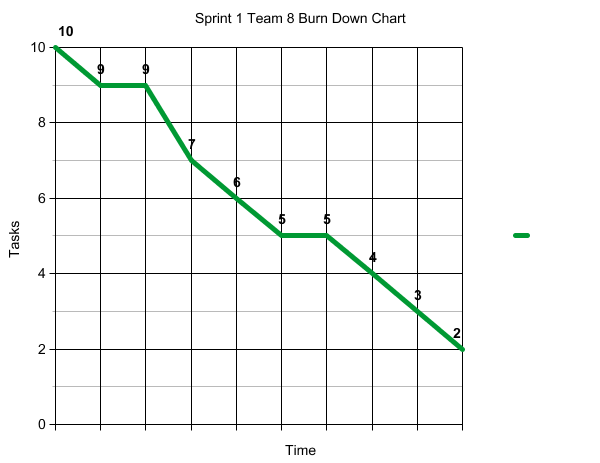

Team 8 Sprint 1 Demo and Retrospective Template

Demo
•	Status of the software to be developed – summary

Login and Sign up features, add rating, data structures for teacher and review, email teacher, layouts. All completed.

•	[3-5 screenshots](./sprint1_screenshots.md)
•	[Video demo of the application (YouTube link)](https://youtu.be/2iMXF9qL-Z4)

•	[Apk, link or equivalent](./Team8_Sprint1_app-debug.apk)

Retrospective
•	Sprint goal
To build a foundation for the app.

•	Number of stories planned versus implemented

5 implemented
7 Planned

•	Planned versus actual velocity

25 implemented
34 Planned

•	Sprint retrospective written summary 

The sprint was mainly completed by Ben Fein while other team members did not have the technical skills to complete the user stories. Ben tried helping other team members to learn the skills which was somewhat successful.

o	What should the team start doing?

Dividing the user stories between team members more equally.

o	What should the team stop doing?

The team should stop relying on certain team members to complete all tasks.

o	What should the team continue doing?
o	(in terms of process, communications …)

Team should continue to respond to all discord messages and review all pull requests as they are created.

•	Status of the evolution of the Product Backlog

Most of the user stories for Sprint 1 were finished. We now have a good base for our app.

•	Burndown chart for the sprint

•	[Statistics from GitHub](https://github.com/paceuniversity/cs389f2021team8/pulse/monthly)
