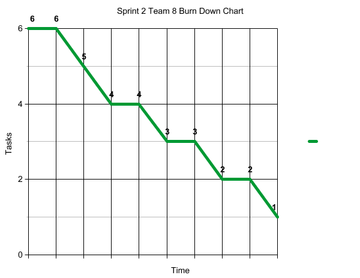

Team 8 Sprint 2 Demo and Retrospective Template

Demo
•	Status of the software to be developed – summary

Login and Sign up features, add rating, data structures for teacher and review, email teacher, layouts. All completed.

•	[3-5 screenshots](./sprint2_screenshots.md)
•	[Video demo of the application (YouTube link)](https://youtu.be/7w5Q7flwBTI)

•	[Apk, link or equivalent](./sprint2.apk)

Retrospective
•	Sprint goal
To revise previous functions to make them better and add some new features.

•	Number of stories planned versus implemented

4 implemented
6 Planned

•	Planned versus actual velocity

36 implemented
27 Planned

•	Sprint retrospective written summary 

This sprint other team members started working harder on the project. After some research one user story was removed because it could not be added because of fire base features. 

o	What should the team start doing?

Keep improving communication.

o	What should the team stop doing?

The team should stop relying on certain team members to complete all tasks.

o	What should the team continue doing?
o	(in terms of process, communications …)

Team should continue to respond to all discord messages and review all pull requests as they are created.

•	Status of the evolution of the Product Backlog

Most of the user stories for Sprint 1 were finished. We are moving future on completing the backlog.

•	Burndown chart for the sprint

•	[Statistics from GitHub](https://github.com/paceuniversity/cs389f2021team8/pulse/monthly)
